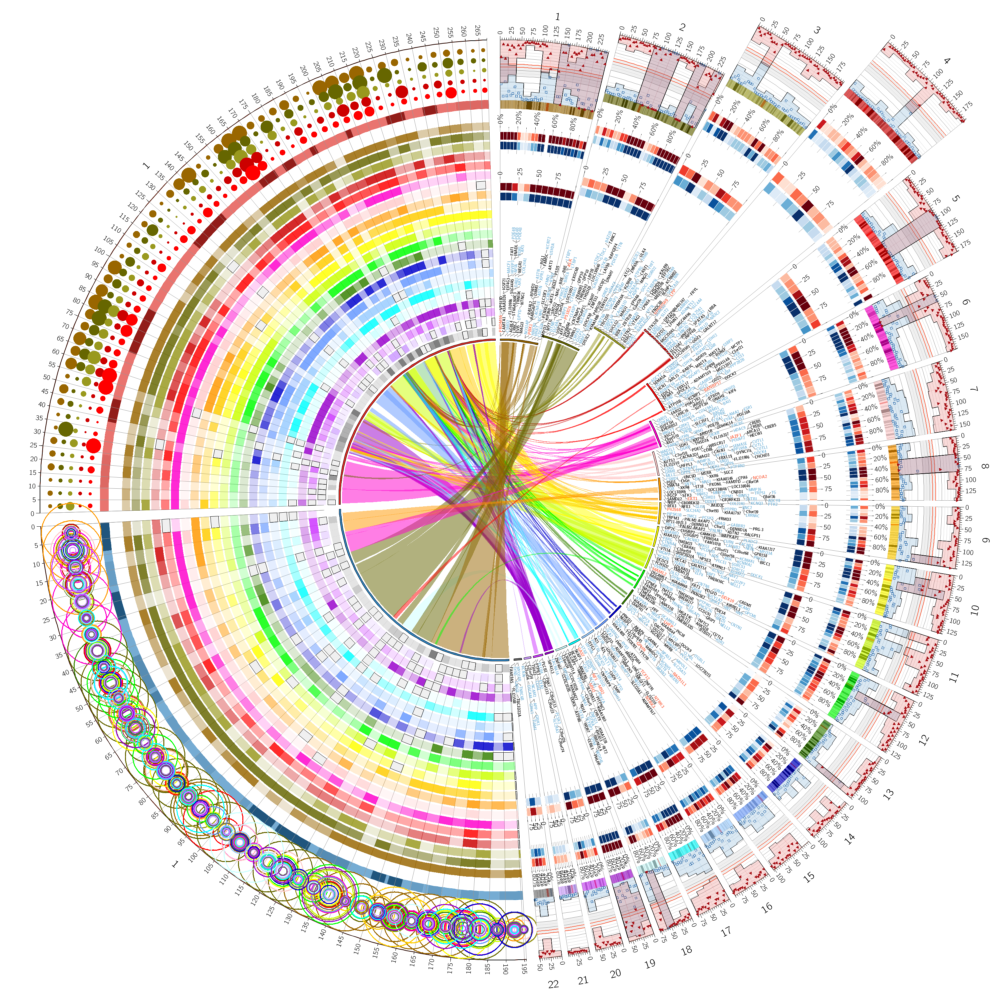
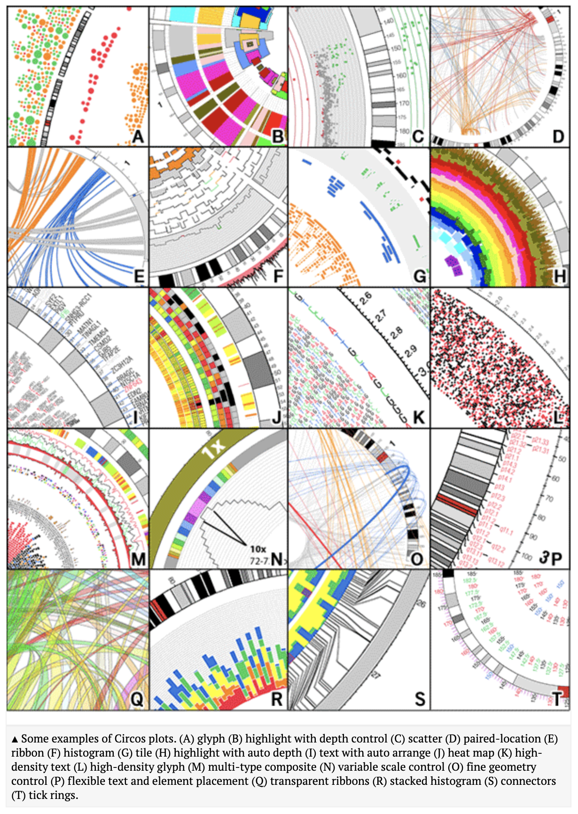
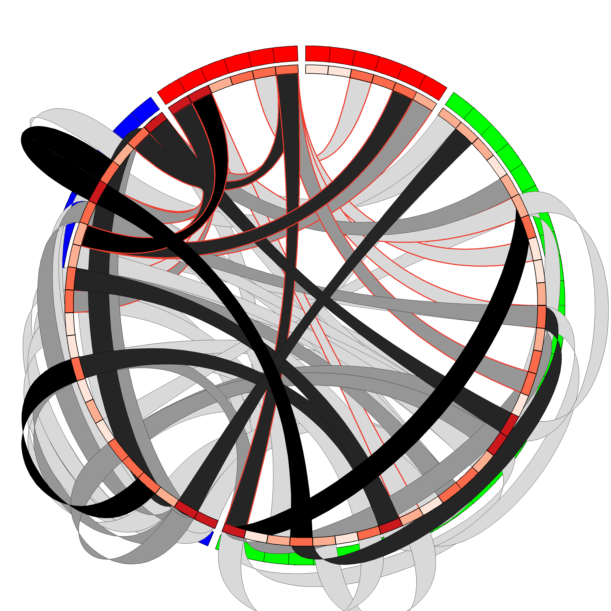
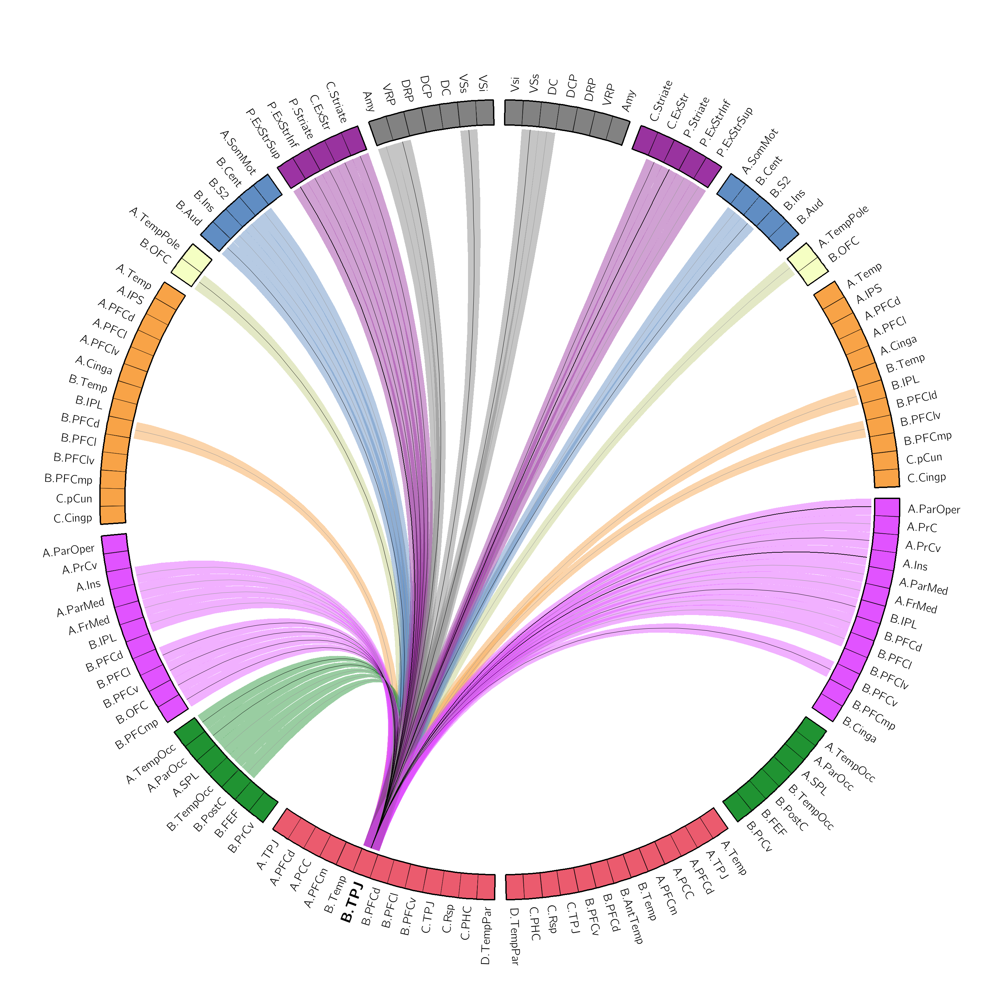
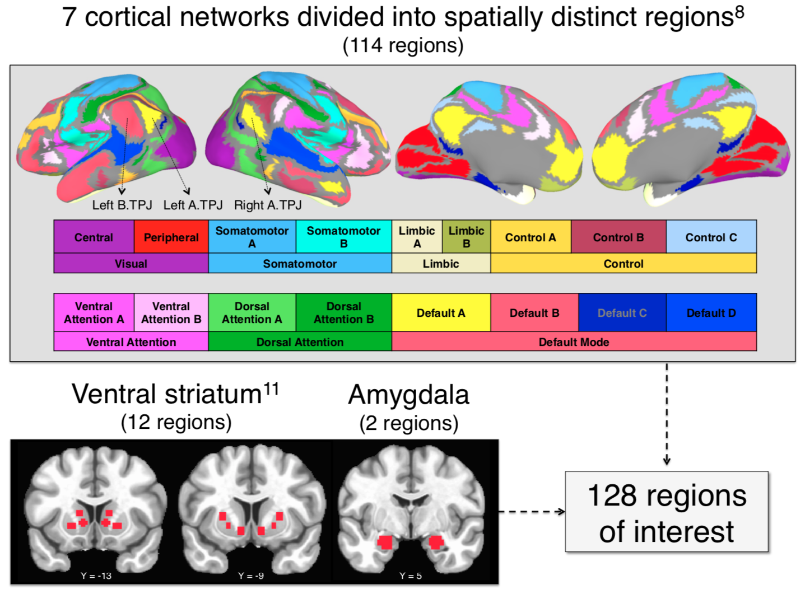
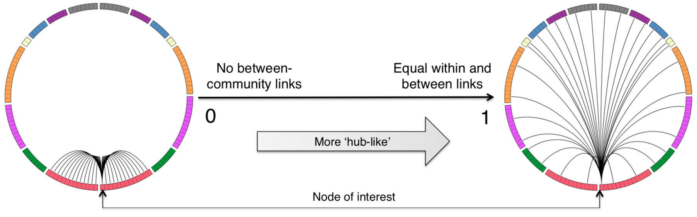
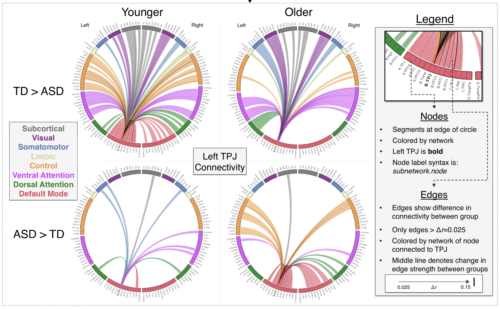

<center>
	{width=100%}
</center>

-----

## What is Circos?

- A perl-based software package for visualizing data in a circuluar format
- From [http://circos.ca](http://circos.ca/): _"... a high data-to-ink ratio, richly layered data and pleasant symmetries"_
- _"Circos attempts to bring a different aesthetic to science and strike a balance flexibility and ease-of-use"_
- Images are defined using text-based configuration and data files, which makes it easily script-able
- The website is super informative, if not a bit overwhelming (so many features). 
- Massive amounts of feature tutorials are available on the website and to download to run/customize on your own
	+ Want to play with band transparancy?
	+ Want to add a band of node-specific histograms?
	+ Want to offset a particilar section of your connectogram for emphasis?
	+ See the tutorials!

#### Examples of features you could include

[http://circos.ca/intro/features/](http://circos.ca/intro/features/)

<center>
	{width=60%}
</center>

-----


## Download and Installation

#### Requirements

- Perl
	+ If you're in a Unix or MacOS environment then you've got it
	+ For Windows users see [here](http://circos.ca/software/installation/)
- Perl modules (you'll certianly need to install a few)
- True type fonts (TTF), you'll likely need to recompile the GD graphics library with TTF

#### How to install and check your installation

- Download and unpack the [Circos tarball](http://circos.ca/software/download/)
	+ You can also download some extra tools and the tutorials, which can be helpful
- Unpack the tarball: `tar xvfz circos-0.69-9.tgz`
- Navigate to Circos directory and check which modules you need

```{r engine = 'bash', comment = ''}
cd ~/Applications/circos-0.69-9/bin
./circos -modules
```

#### Installing missing perl modules

See [here](http://circos.ca/documentation/tutorials/configuration/perl_and_modules) for more info.

```{r engine = 'bash', comment = '', eval = FALSE}
# use the perl CPAN shell
perl -MCPAN -e shell

## within the CPAN shell ##

# do for each module
install Config::General
```

#### Compiling GD

By far the most annoying part of the installation... but at least there is a decent tutorial on compiling GD with all relevant libraries [here](http://circos.ca/documentation/tutorials/configuration/perl_and_modules).

#### Check that everything works

```{r engine = 'bash', comment = '', eval = FALSE}
cd ~/Applications/circos-0.69-9/example # or wherever you installed it
./run # will generate a logfile in /example/run.out
```

If everything looks good, you should see `circos.svg` and `circos.png` in `circos-0.69-9/example`, which appears at the top of this presentation.


-----


## Project organization and implementation

```{r engine = 'bash', comment = ''}
# sample directory structure
tree ./circos_data
```

```{r engine = 'bash', comment = ''}
# run circos
cd ./circos_data
circos
```

**NB:** if you run the `circos` command without flags, it will look in "logical" places for `etc` and `data`, however you can also manually provide the config file using `-config filename.conf` flag. By default it will write `circos.png` and `circos.svg` images to the directory from which the command was run, but this can also be changed using `-outputdir` and `-outputfile` flags.

-----


## Pros and Cons

#### Pros

- Aesthetically appealing (the Ohh factor)
- Has the ability to present complex multidimensional node- and link-wise metrics (the Ahh factor)
- Incredibly customizable
- Text-based data and configuration files make it easily script-able
	+ Especially helpful for large datasets

#### Cons

- Not simple to install
- Plots can easily get messy and it takes a lot of thought to figure out how to present your "take home" message
- Written for genomics, which makes the terminology unintuitive
- Having complete control can be paralyzing

For example:

My first Circos image (circa 2014)...

<center>
	{width=75%}
</center>

Playing with ribbon geometry (circa 2016)...

<center>
	{width=75%}
</center>

-----

## Typical Circos workflow

[From website:](http://www.circos.ca/documentation/tutorials/configuration/configuration_files/)

- Determine how you'd like to visualize your data
- Parse the data into Circos format
- Constructiong a configuration file
- Running Circos to generate image
- Edit image for publication (to say, add a legend)


### [See tutorials for more info than you need to know](http://circos.ca/documentation/tutorials/)


-----

## Example

#### [Connectogram recipe tutorial](http://circos.ca/documentation/tutorials/recipes/cortical_maps/)

<center>
	{width=75%}
</center>

```{r message=FALSE}
# get things ready
#setwd('~/iCloud/circos_demo')
library(Hmisc) # for rcorr
library(ggplot2)
library(plyr)
ids <- read.table('./raw/txt/subj_ids.txt', header=TRUE, colClasses="factor") # subject IDs
idx <- read.csv('./raw/txt/reordered_abide_rois_SURF.csv') # indicies to reorder ROIs
ci <- read.csv('./raw/txt/yeo_vol_com.csv') # node communities
pheno <- read.csv('./raw/txt/NYU_pheno.csv') # phenotypic data
pheno$Mean <- as.numeric(pheno$Mean)
pheno$FIQ <- as.numeric(pheno$FIQ)
pheno$AGE_AT_SCAN <- as.numeric(pheno$AGE_AT_SCAN)
pheno$SUB_ID <- as.factor(as.numeric(as.character(pheno$SUB_ID)))
```

<center>
	{width=100%}
</center>

-----


#### See the raw data

```{r fig.height = 3, fig.width = 8, fig.align = 'center'}
ss <- paste0('00',ids$subj[3])
s.dat <- read.table(paste0('./raw/vol/',ss,'.lh.amy.1D'), stringsAsFactors=FALSE)
head(s.dat) # raw data from amygdala ROI
sig <- as.numeric(s.dat[-1,-1])
ggplot(data.frame(sig), aes(1:length(sig),sig)) + 
	geom_line() +
	theme_bw()
```


### Read in data and create correlation matrices

```{r fig.height = 6, fig.width = 6, fig.align = 'center'}
cormats <- list()
for (ss in levels(ids$subj)){
	id <- paste0('00',ss)
	# read in timeseries
	dim <- read.table(paste0('./raw/vol/',id,'.VS.1D'), stringsAsFactors=FALSE)[-1,-1]
	amy.rh <- as.numeric(read.table(paste0('./raw/vol/',id,'.rh.amy.1D'), stringsAsFactors=FALSE)[-1,-1])
	amy.lh <- as.numeric(read.table(paste0('./raw/vol/',id,'.lh.amy.1D'), stringsAsFactors=FALSE)[-1,-1])
	yeo.rh <- read.table(paste0('./raw/yeo/',id,'_rh.yeo17split.1D'), stringsAsFactors=FALSE)[-1,-1]
	yeo.lh <- read.table(paste0('./raw/yeo/',id,'_lh.yeo17split.1D'), stringsAsFactors=FALSE)[-1,-1]
	# # assemble into timeseries matrix
	raw <- cbind(dim,amy.rh,amy.lh,yeo.rh,yeo.lh)
	raw <- matrix(unlist(lapply(raw,as.numeric)), ncol=length(raw), byrow=FALSE)
	nraw <- raw[,idx$new.reind]
	# create correlation matrix
	cormats[[ss]] <- rcorr(raw)$r
	cormats[[ss]] <- round(cormats[[ss]],4)
	diag(cormats[[ss]]) <- 0
	cormats[[ss]][cormats[[ss]]<0] <- 0
}
heatmap(cormats[[1]])
```

-----


### Calculate participation coefficient

See [Rubinov & Sporns, 2010](https://www.sciencedirect.com/science/article/pii/S105381190901074X?via%3Dihub) for more info on graph theoretic metrics.

<center>
	{width=100%}
</center>

```{r}
part.coef <- function(w,Ci) {
	n <- nrow(w) # number of rows (and columns as matrix should be symmetrical 
	Ko <- apply(w,1,sum) # grab node-wise degree
	pos.val <- w # copy matrix to mask
	pos.val[pos.val!=0] <- 1 # binary matrix for community mask
	Gc <- pos.val%*%diag(c(Ci)) # create community mask
	Kc2 <- vector('numeric',n) # container for community-wise degree
	for (i in 1:max(Ci)) {
		Kc2 = Kc2+rowSums(w*(Gc==i))^2 # grab community degree
	}
	P <- round(array(1,n)-Kc2/(Ko^2),4) # calculate and round participation coefficient
	return(P)
}

# calculate participation coefficients
part.coefs <- array(0, dim = c(128, length(ids$subj)))
count <- 0
for (ss in levels(ids$subj)) {
	count <- count+1
	part.coefs[,count] <- part.coef(cormats[[ss]], ci$com)
}
part.coefs <- aperm(part.coefs)
part.coefs <- data.frame(part.coefs, SUB_ID=ids$subj)

# grab the final sample and merge data
roi <- 'X108'
tP <- data.frame(SUB_ID=part.coefs$SUB_ID,roi=part.coefs[,roi])
tP <- merge(pheno, tP, by='SUB_ID')
fin <- subset(tP, tP$SEX==1 & tP$Mean<0.1 & tP$AGE_AT_SCAN<19.74)
fin <- fin[complete.cases(fin$roi),]
```

Now examine the interaction effect between diagnostic group and age on participation coefficient

```{r fig.height = 4, fig.width = 8, fig.align = 'center'}
summary(lm(roi ~ DX_GROUP*AGE_AT_SCAN + Mean + FIQ + EYE_STATUS_AT_SCAN, data=fin))

mod <- lm(roi ~ Mean + FIQ + EYE_STATUS_AT_SCAN, data=fin)
new <- data.frame(res=residuals(mod),grp=fin$DX_GROUP,age=fin$AGE_AT_SCAN)
new$Group <- revalue(as.factor(new$grp), c('1'='ASD', '2'='TD'))

ggplot(new, aes(age,res,color=Group)) + 
	geom_point() + 
	geom_smooth(method='lm',fill='grey80') +
	scale_color_manual(values=c('forestgreen','steelblue')) +
	scale_x_continuous(breaks=c(6,7,8,9,10,11,12,13,14,15,16,17,18,19,20)) +
	scale_y_continuous(breaks=c(-.1,0)) +
	theme_bw() +
	labs(x='Age',y='Residuals') +
	theme(axis.text.x=element_text(size=14),
		axis.text.y=element_text(size=14))

```
-----


### Prepare Circos data files

#### The karyotpye file

More info [here](http://circos.ca/documentation/tutorials/ideograms/karyotypes/)

```
chr - ID LABEL START END COLOR
band ID LABEL LABEL START END COLOR
```

- `chr`: definition of a chromosome
- `band`: band within a chromosome
- `ID`: identifer, which can be used in plot labels
- `start` and `end`: denotes the size of the chromosome (eg 0 99)
- `color`

-----


#### Manually created structure file

```{r engine = 'bash', comment = ''}
cat ./raw/txt/cir_prep_str.csv
```

#### Structure labels

```{r}
str <- read.csv('./raw/txt/cir_prep_str.csv',stringsAsFactors=FALSE)
str$module <- factor(str$module,levels=c('Subcortical','Visual','Somatomotor','Limbic','Control','VentAttn','DorsAttn','Default'))
n <- length(str$module)
hemi <- as.factor(c('lh','rh'))

chr <- vector('character',n)
init <- vector('numeric',n)
end <- vector('numeric',n)
name <- vector('character',n)
ii <- 0
for (mm in levels(str$module)) {
	l.loc <- 0
	r.loc <- 0
	for (hh in levels(hemi)) {
		temp <- subset(str,str$module==mm & str$hemi==hh)
		for (rr in 1:length(temp$roi)) {
			ii <- ii+1
			if (temp$hemi[rr]=='lh') {
				chr[ii] <- paste0(temp$module[rr],'-l')
				init[ii] <- l.loc
				end[ii] <- l.loc+99
				name[ii] <- temp$roi[rr]
				l.loc <- l.loc+100

			} else {
				chr[ii] <- paste0(temp$module[rr],'-r')
				init[ii] <- r.loc
				end[ii] <- r.loc+99
				name[ii] <- temp$roi[rr]
				r.loc <- r.loc+100
			}
		}
	}
}
str.label <- data.frame(chr,init,end,name)
write.table(str.label,'./circos_data/data/structure.label.txt',col.names=FALSE,row.names=FALSE,quote=FALSE)
```

```{r engine = 'bash', comment = ''}
cat ./circos_data/data/structure.label.txt
```

-----


#### Segment labels

```{r}
dat <- str.label
col.1 <- vector('character',n)
col.2 <- vector('character',n)
col.3 <- vector('character',n)
col.4 <- vector('character',n)
col.5 <- vector('numeric',n)
col.6 <- vector('numeric',n)
col.7 <- vector('character',n)

ii <- 0
for (mm in levels(dat$chr)) {
	ii <- ii+1
	temp <- subset(dat, dat$chr==mm)
	col.1[ii] <- 'chr'
	col.2[ii] <- '-'
	col.3[ii] <- as.character(temp$chr[1])
	col.4[ii] <- strsplit(as.character(temp$chr[1]),'-')[[1]][1]
	col.5[ii] <- 0
	col.6[ii] <- max(temp$end)
	col.7[ii] <- 'black'
	sub.str <- subset(str, str$module == strsplit(as.character(temp$chr[1]),'-')[[1]][1])
	for (rr in 1:length(temp$name)) {
		ii <- ii+1
		col.1[ii] <- 'band'
		col.2[ii] <- as.character(temp$chr[rr])
		col.3[ii] <- as.character(temp$name[rr])
		col.4[ii] <- as.character(temp$name[rr])
		col.5[ii] <- temp$init[rr]
		col.6[ii] <- temp$end[rr]
		col.7[ii] <- sub.str$col.name[grep(temp$name[rr],sub.str$roi)[1]] 
	}
}
seg <- data.frame(col.1,col.2,col.3,col.4,col.5,col.6,col.7)
write.table(seg,'./circos_data/data/segments.txt',col.names=FALSE,row.names=FALSE,quote=FALSE)
```

```{r engine = 'bash', comment = ''}
cat ./circos_data/data/segments.txt
```

-----


### Links

#### Defining links

More info [here](http://circos.ca/documentation/tutorials/links/basic_links/)

```
CHR_START START END CHR_END START END type=1, score=1
```

`CHR_START`: Chromosome link begins
`START` and `END`: location on chromosome
`type`: can be used for rules
`score`: can be used for rules (I use it for link weight)

-----


For the poster I wanted 4 connectograms to show the group by age interaction:

- younger half of sample
	+ TD > ASD
	+ ASD > TD
- older half of sample
	+ TD > ASD
	+ ASD > TD

For this example I'll just show TD > ASD in the older sample.

```{r}
# Create group-averaged matrices
grp.mat <- function(subs,mats,n) {
	fin.mat <- array(0, dim=c(n,n))
	for (ss in 1:length(subs)) {
		fin.mat <- fin.mat+cormats[[subs[ss]]]
	}
	fin.mat <- fin.mat/length(subs)
	return(fin.mat)
}
prep.circos.links <- function(mat,guide) {
	temp <- mat*lower.tri(mat)
	temp <- round(temp,3)
	N <- ncol(mat)
	n <- length(temp[temp>0])
	s.name <- vector('character',n)
	s.on <- vector('numeric',n)
	s.off <- vector('numeric',n)
	e.name <- vector('numeric',n)
	e.on <- vector('numeric',n)
	e.off <- vector('numeric',n)
	type <- vector('character',n)
	ind <- 1
	for (ii in 1:N) {
		for (jj in 1:N) {
			if (temp[ii,jj]>0) {
				s.name[ind] <- as.character(guide$name[ii])
				s.on[ind] <- guide$on[ii]
				s.off[ind] <- guide$off[ii]
				e.name[ind] <- as.character(guide$name[jj])
				e.on[ind] <- guide$on[jj]
				e.off[ind] <- guide$off[jj]
				type[ind] <- paste0('type=1,score=',temp[ii,jj])
				ind <- ind+1
			}
		}
	}
	fin <- data.frame(s.name,s.on,s.off,e.name,e.on,e.off,type)
	return(fin)
}

m <- mean(fin$AGE_AT_SCAN)
old <- subset(fin, fin$AGE_AT_SCAN>m)
a.o <- subset(old, old$DX_GROUP==1) # ASD group
a.mat <- grp.mat(a.o$SUB_ID,cormats,128)
a.mat[-108,-108] <- 0 # zero out all but ROI

t.o <- subset(old, old$DX_GROUP==2) # TD group
t.mat <- grp.mat(t.o$SUB_ID,cormats,128)
t.mat[-108,-108] <- 0 # zero out all but ROI

t.minus.a <- t.mat-a.mat

guide <- str.label
names(guide) <- c('name','on','off')
 
links <- prep.circos.links(t.minus.a,guide)
write.table(links,'./circos_data/data/links.txt',col.names=FALSE,row.names=FALSE,quote=FALSE)
```

```{r engine = 'bash', comment = ''}
cat ./circos_data/data/links.txt
```


-----


## Circos config file

```{r engine = 'bash', comment = ''}
cat ./circos_data/etc/circos.conf
```

### Sample imported config file

```{r engine = 'bash', comment = ''}
cat ./circos_data/etc/ideogram.conf
```

-----

### Run Circos

```{r engine = 'bash', comment = ''}
cd ./circos_data
circos
```

---

### Final plot

Circos does not generate legends or extra labels (such as the hemisphere designation in my figure).
These need to be manually added in your figure editor (e.g., Illustration, Power Point)

<center>
	{width=100%}
</center>


